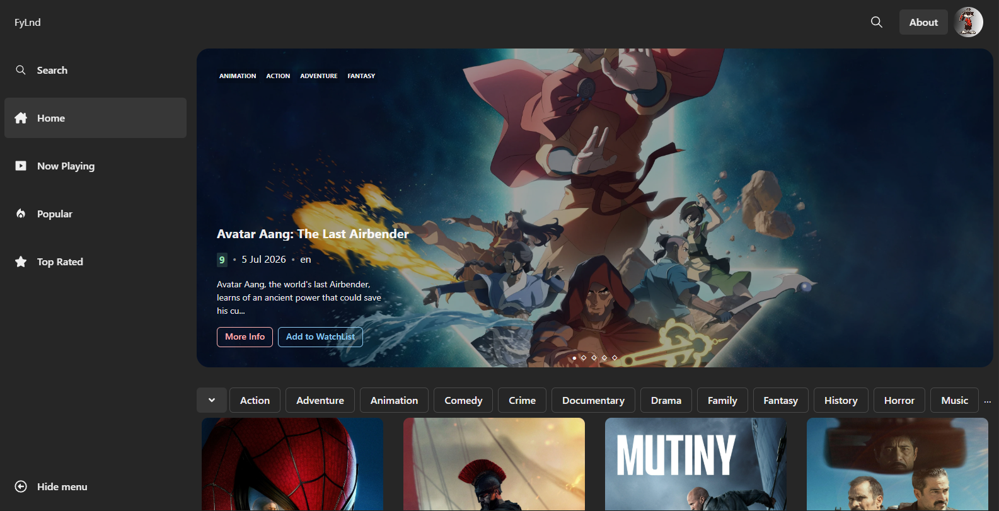
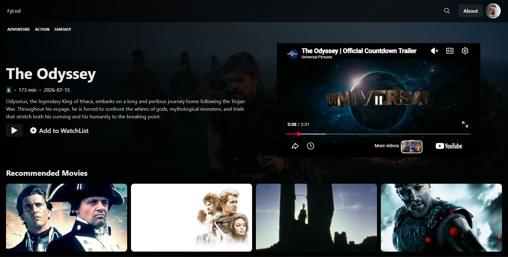
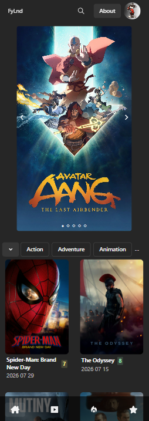

# FyLnd

FyLnd is a responsive movie discovery web application that makes it easy to browse, search, and discover movies across a wide range of genres.

Explore popular, highly rated, and currently playing movies, view detailed information about individual movies, and find something new to watch.

## Screenshots

### Desktop



### Movie Details



### Mobile



## Features

- Browse movies
- Search for movies
- Filter movies by genre
- Browse Popular, Now Playing, and Top Rated movies
- Hero banner featuring movies
- Detailed movie information
- Watch movie trailers
- Infinite scrolling
- Responsive design
- Responsive navigation
- About page with TMDB attribution
- Watchlist _(coming soon)_

## Built With

- React
- TypeScript
- Vite
- Chakra UI
- TanStack Query
- React Router
- Zustand
- Axios
- TMDB API

## Getting Started

### Installation

Clone the repository:

```bash
git clone ...
```

Navigate into the project directory:

```bash
cd ...
```

Install the dependencies:

```bash
npm install
```

Start the development server:

```bash
npm run dev
```

## Environment Variables

Create a `.env` file in the root of the project and add your TMDB API key:

```env
VITE_TMDB_API_KEY=your_api_key
```

## Project Structure

```text
src/
├── assets/
├── components/
├── hooks/
├── pages/
├── services/
├── store/
└── types/
```

## Future Improvements

- Watchlist
- User authentication
- Additional personalization features

## Data & Attribution

Movie information, images, ratings, and other movie-related data are provided by **The Movie Database (TMDB)**.

This product uses the TMDB API but is not endorsed or certified by TMDB.

## Acknowledgements

This application uses the [TMDB API](https://developer.themoviedb.org/) to provide movie data and images.
